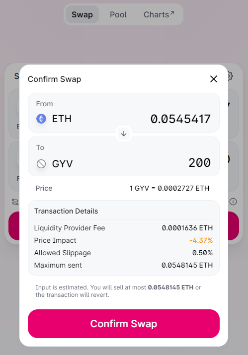
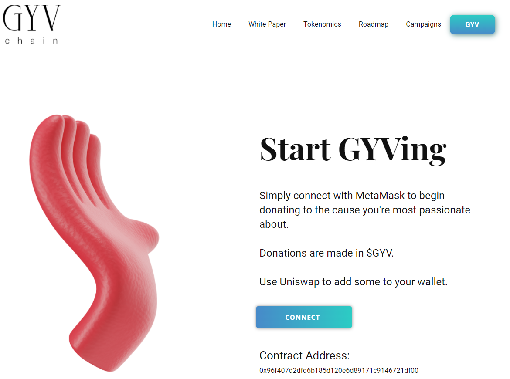

# gyvchaincore
This project is all about creating a blockchain solution for charity-related crowdfunding efforts.  The project and ideas around our implementation, originated from a discussion we had as a project team while participating in a Monash University Bootcamp.  From there, the ideas for this project took shape.

# Overview

Charities: there are over 48,000 in Australia alone in 2020-21, of which about 20% are large and 65% small, less than $250,000 per annum, with half of those less than $50,000 per annum. Some of the key challenges for charities include high levels of cost for administration, marketing, customer support, operational and supply chain, finance and banking, regulatory and lobbying. All these costs reduce the percentage of funds that make it to the frontline of the charity where it is needed. In addition, many of the charities struggle to be seen or heard in a sea of good intentions. Charities can also struggle to document costs for donors to see and convert donor goodwill into cash. Enter blockchain, a technology that lends itself to this type of industry, where information is written to the online public blockchain for all to see, generating transparency and timeliness where transactions are instant. 

GVY Chain is a platform designed to address these charitable challenges by providing an instant, transparent, and low-cost vehicle to transfer funds immediately and directly from donor to frontline charity recipients where they can do their goodwill. This technology allows for charities to move from a web page presence to web3 interactivity, providing a new and attractive channel for fund raising. Donors give because it makes them feel good, however sometimes they are reticent to give if they are not sure where their hard earned money is being spent. For donors, GYV Chain provide donors with the opportunity to connect to charities, particularly small frontline charities, and directly fund a chosen cause with the ability to see the transactions on the public blockchain and even be rewarded for participating.
The platform itself consists of the GYV Chain website powered by Ethereum ERC-20 technology, operating in a low-cost solidity contract environment connected to the front-end interaction via front end web 3 support by Moralis and blockchain transaction interactivity using the Metamask wallet and an exchange such as Uniswap. The website is designed to be friendly for charities to set up charitable campaigns which they can link back to their own websites or stand alone on the GYV Chain, and for donors to find the page and donate GYV tokens directly to the charities of their choice. There are instructions on the web page on how to set up a Metamask wallet which allows the conversion of Fiat currency into layer 1 core cryptocurrencies such as ETH, and transact on an exchange (eg, on Uniswap) for GYV tokens. GYV can be directly contributed to the donor's favourite cause.

GYV Chain as a blockchain charity concept is set up to generate a total supply of 500 million GYV token, to be minted upon launch and released in stages. the initial coin offering to the public is 30% or 150 million tokens for an initial period of 30 days. Over subscription will result in monies returned to buyers, while any under subscription of token demand is reverted to a central pool, where 50% of the total tokens, 250 million tokens held for future released to maintain a stable level of the liquidity in the currency to support its activities. 10% all 50 million tokens are set aside for the founders to continue their charitable works, while the remaining 10% or 50 million give tokens is used 2 find and maintain the operational aspects of the platform, including generating promotional and marketing incentives for diners to participate in the gift platform for example non fungible token prizes like merchandise T-shirts, caps, sports and fashion shoes gradually leading up to more attractive prizes such as dinners with celebrities, vehicle prices, holiday giveaways and the like.

The best charities have operational costs of around 10%, and these are generally large well established and funded organisations, the further down the list of charities you go, the higher the percentage of operational and management costs as a percentage of their overall donation revenue. GYV Chain operates on a flat 10% support fee, of which 2% is used to randomly fund participating charities, and 2% used to fund rewards such as non-fungible token prizes and the like for donors participating in the platform. The remaining 6% is split between operational costs and maintenance of pool liquidity to ensure that the platform has long term viability.  What this means is that when a donor contributes an amount of money for example $100, $90 will make its way to the front-end charity wallet owner, and $10 will be tithed full platform activities. For the donor these activities are plain to see on the blockchain, and provided protocols are in place to accurately identify the charity wallet owners, they are able to confirm the veracity of the campaign, and potentially see their own funds distribution to goods and services for their charity on the blockchain.

As a concept, GYV Chain is an early representation of the potential and capacity of blockchain to support real life industry, and in particular maintain the transparency and veracity of charitable activities, anyone would be hard press not so see how this will be the future of this type of GYVing.

## Instructions

Here are a few little points on how to prep for, firing up the home page and then donating!

- "Download" this very project from GitHub (just click the download button)
- Open up the page with your preferred browser (Chromium is recommended)
  - `./frontend/GYVweb1.1/Home.html`
- Prepare for a donation by setting up MetaMask (a secure wallet, easy to use)
  - MetaMask has as great starter article [here](https://metamask.zendesk.com/hc/en-us/articles/360015489531-Getting-started-with-MetaMask)
  - Add Ethereum to your wallet (NOTE: this needs to be done on the Kovan Testnet using what is known as a faucet, a.k.a a tap :)
  - Find the faucet [here](https://faucets.chain.link/kovan)
  - Learn more about the great things the Kovan Team are doing [here](https://kovan-testnet.github.io/website/)
- In order to donate, one would need to go to Uniswap (NOTE: make sure your MetaMask is connected to Kovan) and swap the Ethereum you've just added to your wallet, for GYV.  
- Now you're in a position to donate!!!
- Below is all you need to know about the Frontend, and donating to your cause!

  

## Frontend

### Home Page
Blah.

  

### GYV Page
Blah.

  

## Whitepaper

With any project around a blockchain platform, whether for real or a side-project, the whitepaper is, in our view, extremely important for a number of reasons.

- It allows the reader to understand the logic of the Project/Platform, the vision and what the project is trying to solve
- It clearly explains the tokenomics, integral to the smart-contract, without getting bogged down in the detail
- It highlights the next steps and roadmap for the platform and project

The current version of the whitepaper - always under review :) - is available [here](frontend/GYVweb1.1/resources/gyvchain_whitepaper_v1_1.pdf) or if you're having issues accessing it, here is the relative path: `frontend/GYVweb1.1/resources/gyvchain_whitepaper_v1_1.pdf`

## Tools used

### Remix - Solidity

Remix IDE allows developing, deploying and administering smart contracts for Ethereum like blockchains, including the ability to deploy them to an RPC network locally (using Ganache), or a Testnet such as Kovan (references in the document), Ropsten or Binance Smartchain.

### Morallis.io

Moralis provides a managed backend for blockchain projects. Automatically syncing the balances of your users into the database, allowing you to set up on-chain alerts, watch smart contract events, build indexes, and so much more. All features are accessed through an easy-to-use SDK or directly using their libraries (plugging in some good ol' JavaScript).

  

### Brownie - Python framework

Brownie is a Python-based development and testing framework for smart contracts targeting the Ethereum Virtual Machine.

### OpenZeppelin

As part of the contract creation, we used OpenZeppelin's standardised contract library, which allowed us to just think about our own logic and not to worry about writing in additional protections and utilities.  
 - We used the ERC20 token standard, available on GitHub [here](https://github.com/OpenZeppelin/openzeppelin-contracts/blob/release-v3.4/contracts/token/ERC20/ERC20.sol)
 - We used the re-entrancy guard utility token standard, also available on GitHub [here](https://github.com/OpenZeppelin/openzeppelin-contracts/blob/release-v3.4/contracts/utils/ReentrancyGuard.sol)

## Conclusions/Concluding thoughts 

Blah

# Acknowledgements and References
- Remix has been used as the IDE for this little project
- Ganache has also been used to help with the testing off-chain
- I made use of the Chainlink Faucet for the ETH I used in this project, find that [here](https://faucets.chain.link/kovan)
- For the on-chain testing, we used the Kovan Testnet (more [here](https://kovan-testnet.github.io/website/))
- Learn all about OpenZeppelin and the standards of safety they provide at https://docs.openzeppelin.com but more specifically relating to ERC-20 [here](https://docs.openzeppelin.com/contracts/2.x/crowdsales)
- Ethereum Foundation needs to be acknowledged for their work, creating their blockchain, which allows for the deplyment and interaction with "smart-contracts"
- Thanks to Trinity College, an organisation that has provided the training which has allowed for the accomplishment of this demo (as part of a Monash University Bootcamp)

